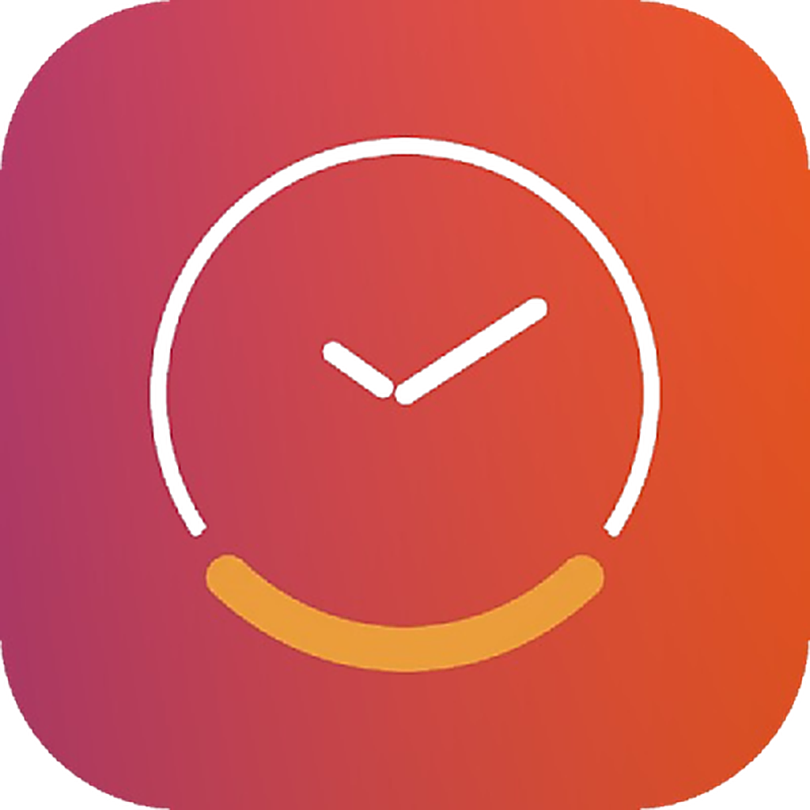

# Hey, I'm Ilyes 👋

**Frontend & Design Engineer** turning complex product ideas into fast, accessible, thoughtful interfaces.

Toulouse, France · Engineering at [Positive Solution](https://www.positive-solution.fr) · Building [Cadran](https://www.cadranapp.com)

---

I work where design and engineering meet. Over <!--XP_START-->8+<!--XP_END--> years, I've helped teams ship product interfaces, establish design systems, and turn interaction details into software that feels intentional. I'm <!--AGE_START-->32<!--AGE_END-->, endlessly curious, and equally comfortable refining a component API or a transition curve.

### What I care about

- Product interfaces with clear hierarchy and purposeful motion
- Design systems that help teams move faster without losing quality
- Accessibility, performance, and resilient frontend architecture
- Native macOS experiences built with Swift and SwiftUI

---

###  Featured work — Cadran

**A desktop clock for macOS, rendered directly on your wallpaper.**

Cadran brings crafted clock faces to every Space and display while staying energy efficient. It combines a native SwiftUI app, Core Animation rendering, and a Next.js product site. Today: 22 clock faces, 40 backgrounds, and full multi-monitor support.

[**Explore Cadran →**](https://www.cadranapp.com)

---

### Toolbox

**Product UI**

**Native & design**

**Tools**

---

### GitHub at a glance

<table>
  <tr>
    <td></td>
    <td></td>
  </tr>
</table>

Cards refresh daily from GitHub Actions.

---

### Connect

